EProject - Microservices Architecture

22655111 Nguyễn Trọng Phúc

Câu 1: Minh chứng

a. Build file .env, Dockerfile cho từng service

b. Build docker-compose.yml và file gitignore

c. Chạy lệnh build lên docker

Build toàn bộ: docker compose build
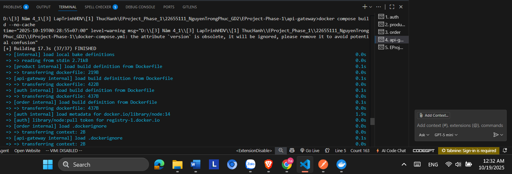
Chạy toàn bộ hệ thống: docker compose up -d

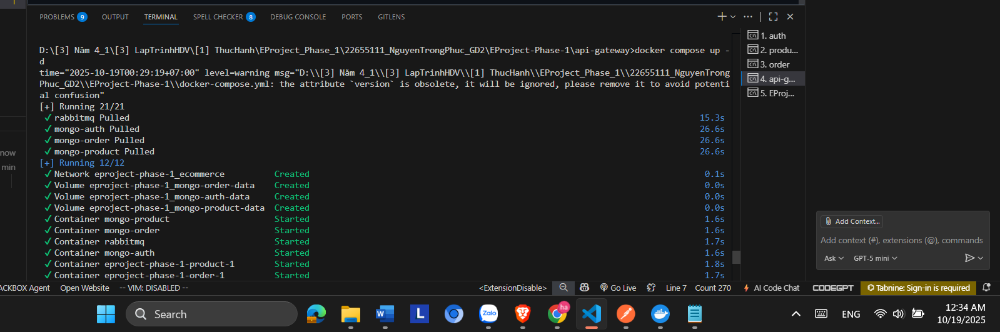

d. Mở được giao diện RabbitMQ

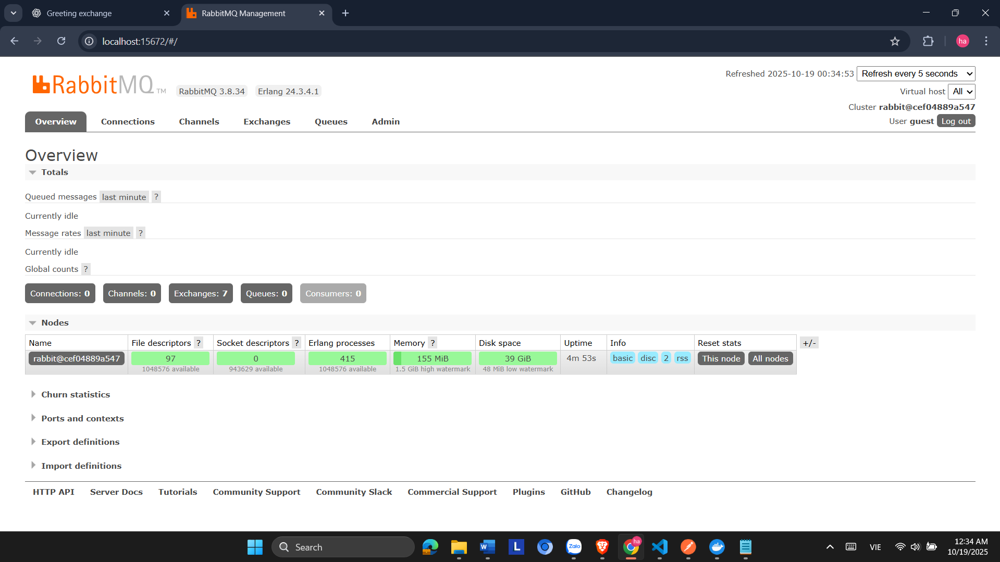

e. Test PostMan

Auth:

1. Đăng ký:

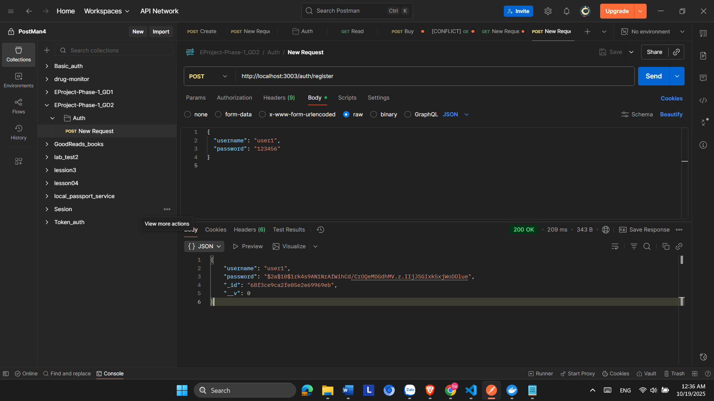

Mongo

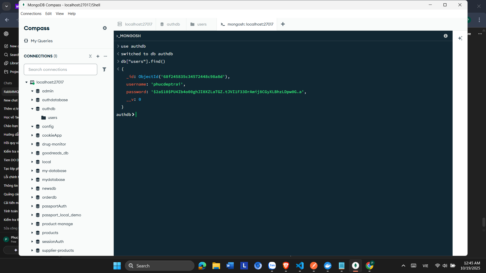

2. Đăng nhập: http://localhost:3003/auth/login

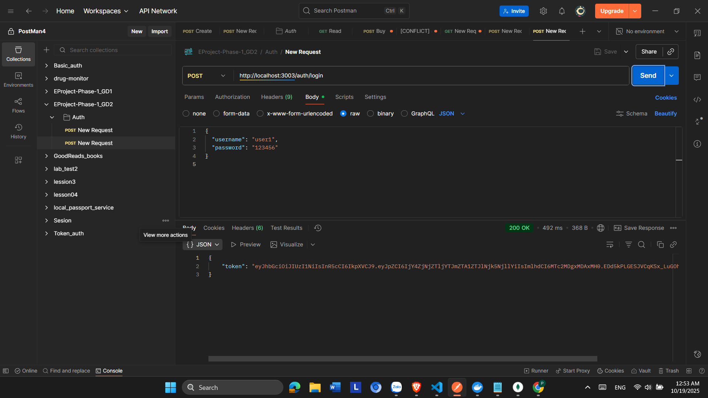

Product

1. Tạo sản phẩm

Mongo

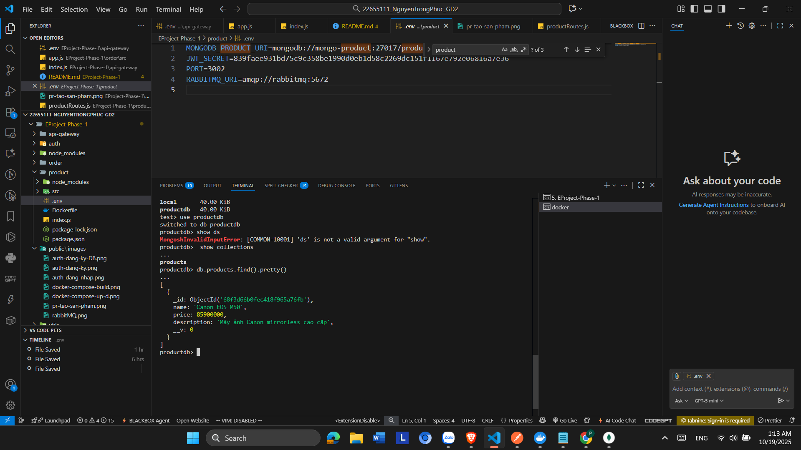

2. Lấy sản phẩm

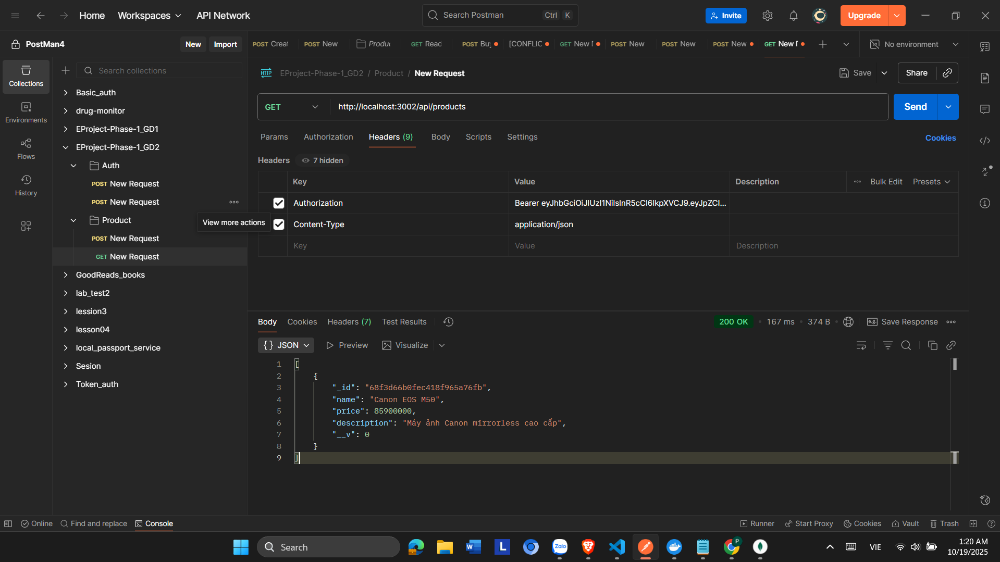

Order

1. Mua hàng:

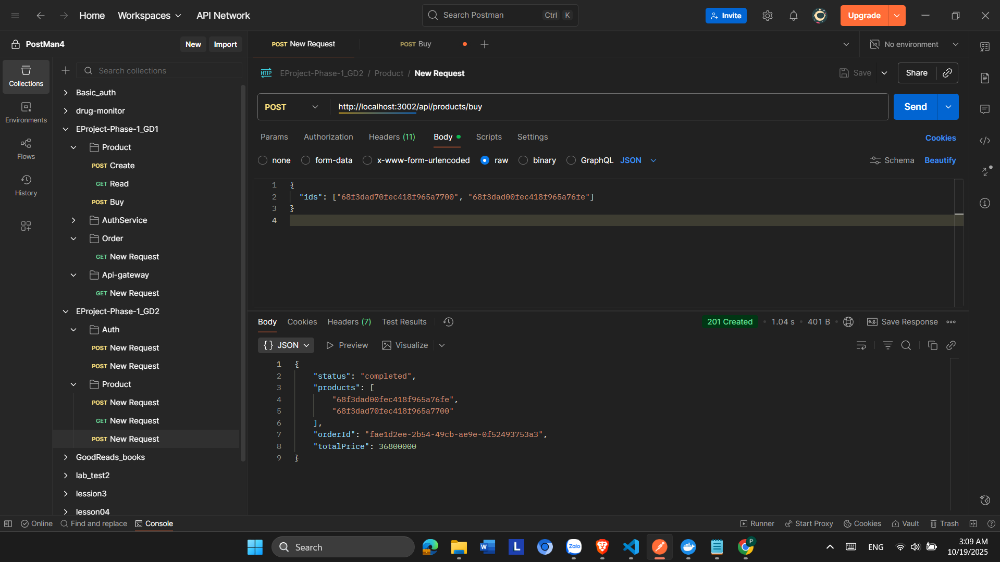

**Câu 2:**

1. **Hệ thống giải quyết vấn đề gì:**

   Hệ thống giải quyết bài toán thương mại điện tử (E-Commerce) bằng cách xây dựng kiến trúc microservice để:

* Quản lý người dùng, sản phẩm, và đơn hàng một cách  độc lập .
* Cho phép các dịch vụ giao tiếp với nhau qua RabbitMQ (AMQP) để  đặt hàng, xác thực, và xử lý giao dịch .
* Giúp hệ thống dễ mở rộng, dễ bảo trì, tránh quá tải khi có nhiều request đến cùng lúc.

  -> Hệ thống giúp mô phỏng quá trình mua hàng trực tuyến — đăng nhập, xem sản phẩm, đặt hàng — thông qua các dịch vụ riêng biệt, đảm bảo tính bất đồng bộ, an toàn và hiệu quả.

2. **Hệ thống có bao nhiêu dịch vụ:**

   Hệ thống có4 dịch vụ chính , bao gồm:

* Auth Service – Dịch vụ xác thực người dùng.
* Product Service – Dịch vụ quản lý và hiển thị sản phẩm.
* Order Service – Dịch vụ tạo và xử lý đơn hàng.
* API Gateway – Cổng giao tiếp trung gian, là điểm vào duy nhất của toàn hệ thống.

3. **Ý nghĩa từng dịch vụ:**

* Auth Service: Quản lý người dùng: đăng ký, đăng nhập, cấp token JWT để xác thực và phân quyền.
* Product Service: Quản lý sản phẩm: thêm, sửa, xóa, xem sản phẩm và thực hiện đặt hàng (buy).
* Order Service: Tiếp nhận đơn hàng từ RabbitMQ, xử lý thông tin đặt hàng, tính tổng giá trị và lưu vào cơ sở dữ liệu.
* API Gateway: Là cầu nối giữa client và các dịch vụ khác, định tuyến yêu cầu đến đúng service, xác thực request và gom kết quả trả về cho người dùng.

4. **Các mẫu thiết kế được sử dụng:**

   *Software Architecture
   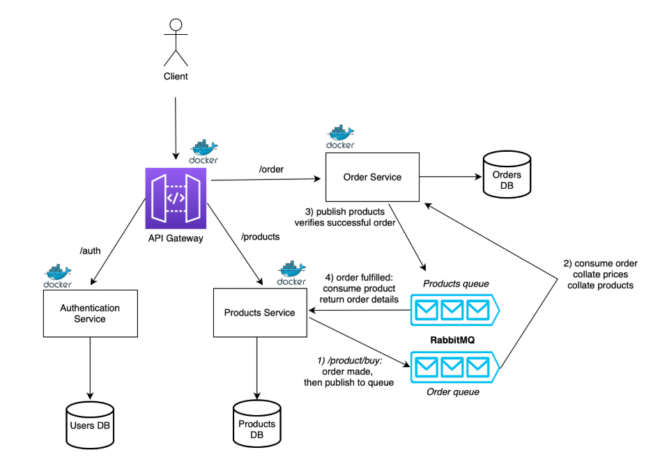
   *

   Hệ thống sử dụng API Gateway để liên kết tất cả các dịch vụ lại với nhau, hoạt động như một proxy trung gian cho các miền mà trong đó các microservice (gồm dịch vụ xác thực Auth , dịch vụ đơn hàng Order, và dịch vụ sản phẩm Product) được triển khai.

   Mỗi microservice ,  API Gateway , và RabbitMQ đều được đóng gói dưới dạng Docker image để triển khai dễ dàng và tách biệt.

   Quá trình tương tác giữa Product Service và Order Service sử dụng giao thức AMQP thông qua  RabbitMQ , trong đó bao gồm hai hàng đợi chính: orders và  products . Cơ chế này giúp tiết kiệm tài nguyên so với việc gọi REST API trực tiếp đến MongoDB.

Cụ thể:

* Product Serrvice sẽ gửi (publish) thông tin đơn hàng vào hàng đợi  orders , sau đó Order Service sẽ nhận (consume) và xử lý dữ liệu đơn hàng.
* Khi xử lý xong, Order Service sẽ gửi lại (publish) thông tin sản phẩm đã được đặt vào hàng đợi  products , và Product Service sẽ nhận (consume) thông tin này để trả về chi tiết đơn hàng cho người dùng.

*Microservice Structure*

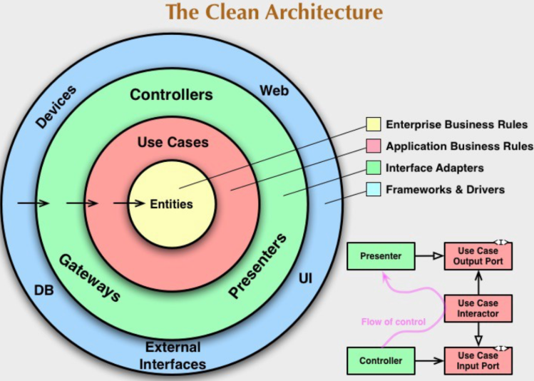

Hệ thống được xây dựng dựa trên **kiến trúc Clean Architecture** (kiến trúc sạch) do **Uncle Bob** đề xuất.

Mô hình này giúp tách biệt rõ ràng các lớp trong hệ thống, đảm bảo  **tính mô-đun cao** , **giảm sự phụ thuộc lẫn nhau (loose coupling)** và dễ dàng **mở rộng hoặc thay thế từng thành phần** mà không ảnh hưởng đến toàn bộ hệ thống.

Cấu trúc của Clean Architecture gồm 4 lớp chính:

* **Entities (Doanh nghiệp cốt lõi):** Chứa các quy tắc nghiệp vụ tổng quát và không phụ thuộc vào framework.
* **Use Cases:** Chứa logic nghiệp vụ ứng dụng, điều phối dữ liệu giữa Entities và Interface.
* **Interface Adapters (Controller, Presenter, Gateway):** Đóng vai trò trung gian, chuyển đổi dữ liệu giữa tầng Use Case và tầng ngoài (web, DB, UI).
* **Frameworks & Drivers:** Là tầng ngoài cùng, bao gồm cơ sở dữ liệu, giao diện web, thiết bị, thư viện hoặc framework (ví dụ như Express, MongoDB, RabbitMQ).

  **5. Các dịch vụ giao tiếp như thế nào:**
* Giao tiếp thông qua**RabbitMQ** – một message broker trung gian.
* **Cơ chế sử dụng:**

  Các dịch vụ **giao tiếp với nhau bằng giao thức AMQP (Advanced Message Queuing Protocol)** – đây là giao thức cho phép các dịch vụ **gửi và nhận thông điệp (message)** thông qua hàng đợi (queue) của RabbitMQ.

  → Cơ chế này là  **push-based** , nghĩa là khi có sự kiện xảy ra, dịch vụ sẽ **đẩy thông điệp ngay lập tức** sang hàng đợi.
* **RabbitMQ đóng vai trò trung gian:**

  RabbitMQ hoạt động như **một hàng đợi tin nhắn** ( *Message Queue* ), đảm bảo các microservice  **hoàn toàn tách biệt** , không cần biết nhau chạy ở đâu, nhưng vẫn trao đổi dữ liệu được.
